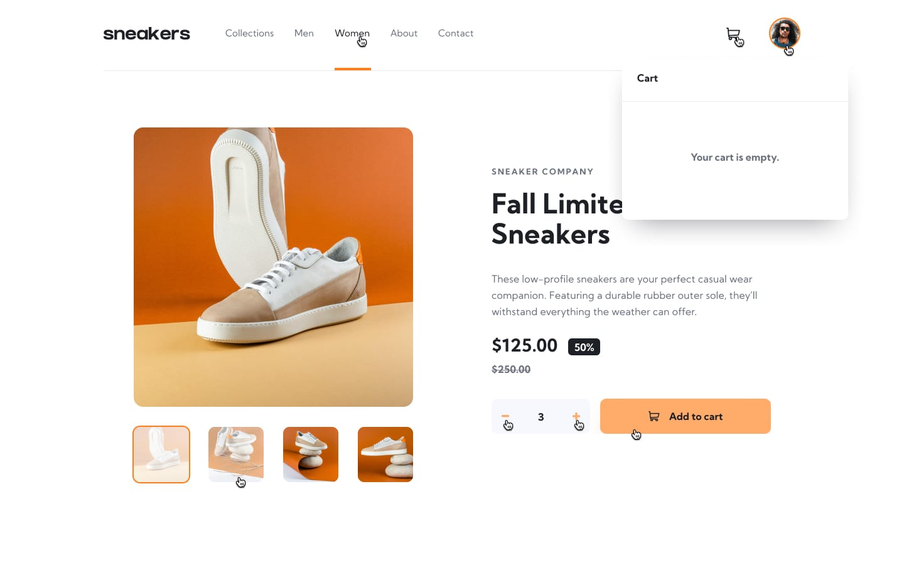

# Frontend Mentor - E-commerce product page solution

This is a solution to the [E-commerce product page challenge on Frontend Mentor](https://www.frontendmentor.io/challenges/ecommerce-product-page-UPsZ9MJp6). Frontend Mentor challenges help you improve your coding skills by building realistic projects.

## Table of contents

- [Overview](#overview)
  - [The challenge](#the-challenge)
  - [Screenshot](#screenshot)
  - [Links](#links)
- [My process](#my-process)
  - [Built with](#built-with)
  - [What I learned](#what-i-learned)
- [Author](#author)

## Overview

### The challenge

Users should be able to:

- View the optimal layout for the site depending on their device's screen size
- See hover states for all interactive elements on the page
- Open a lightbox gallery by clicking on the large product image
- Switch the large product image by clicking on the small thumbnail images
- Add items to the cart
- View the cart and remove items from it

### Screenshot

### Links

- [Solution](https://www.frontendmentor.io/solutions/responsive-e-commerce-product-page-with-react-j5b8i_k6TB)
- [Live Site](https://e-commerce-product-page-topaz.vercel.app)

## My process

### Built with

- Semantic HTML5 markup
- CSS custom properties
- Flexbox
- Mobile-first workflow
- [TypeScript](https://www.typescriptlang.org) - Programming Language
- [React](https://reactjs.org/) - JS library
- [Tailwind](https://tailwindcss.com) - For Styles
- [Motion](https://motion.dev/docs/react-motion-component) - Animation library
- [Swiper](https://swiperjs.com) - Slider Library
- [React Spinners](https://www.davidhu.io/react-spinners/) - A collection of react loading spinners.

### What I learned

- Creating lightbox and image gallery with React.

## Author

- Frontend Mentor - [@firatyedibela](https://www.frontendmentor.io/profile/firatyedibela)
